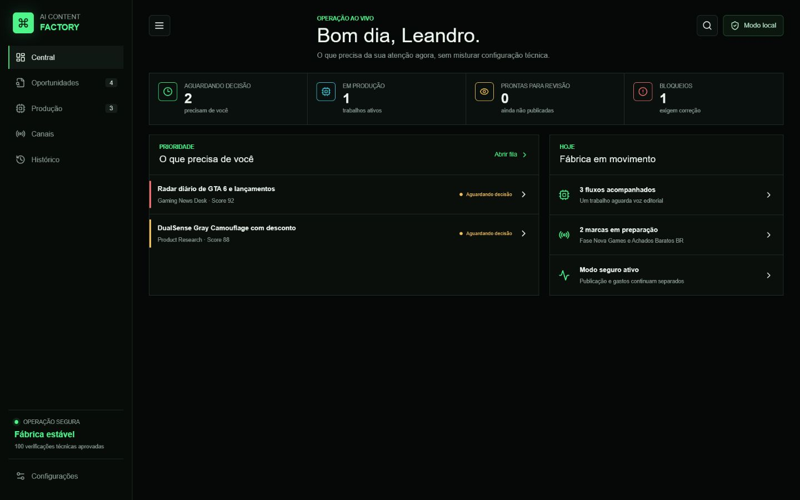
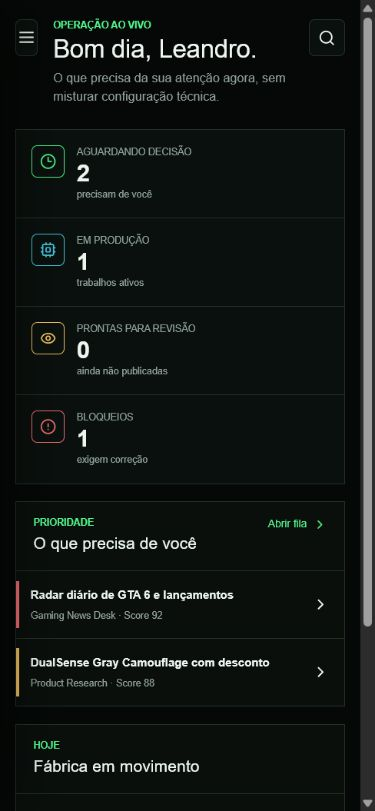
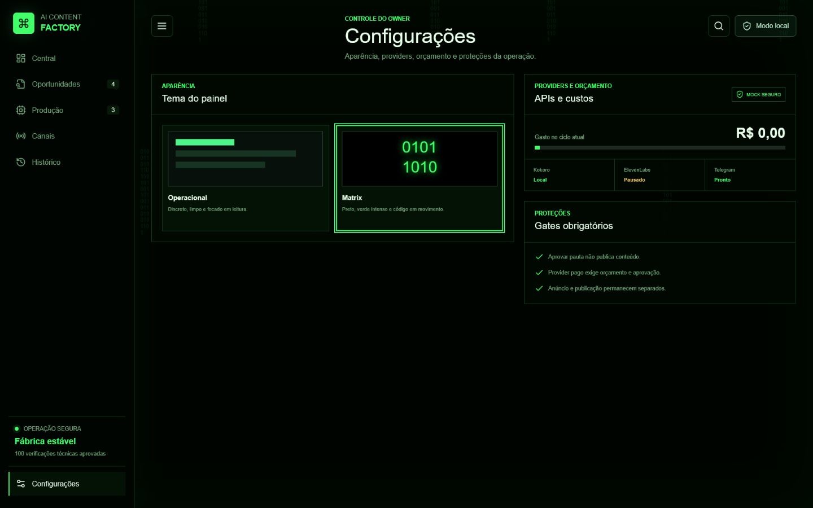

# Central de Comando da AI Content Factory

Este e o primeiro produto diario da fabrica. Ele nao substitui os funcionarios: mostra o que eles encontraram, o que esta sendo produzido, o que esta bloqueado e onde sua decisao e necessaria.

O menu lateral abre areas independentes. A interface nao funciona mais como uma pagina comprida: Central, Oportunidades, Producao, Canais, Historico e Configuracoes mantem cada assunto no seu lugar.

## Fluxo diario

### 1. Comece pela Central

A Central resume apenas o que pede atencao agora. Os indicadores mostram decisoes, producoes, revisoes e bloqueios sem misturar APIs ou detalhes tecnicos.

O texto **100 verificacoes tecnicas aprovadas** representa testes automaticos da arquitetura. Nao significa que um funcionario executara cem tarefas.

### 2. Abra a fila prioritaria

Abra **Oportunidades**. Cada linha informa origem, canal, score e estado. Use a busca ou os filtros para reduzir a fila.

### 3. Leia a avaliacao antes de decidir

Ao selecionar uma linha, o painel lateral mostra:

- confianca da pesquisa;
- risco identificado;
- proxima acao recomendada;
- canal e prioridade.
- fontes clicaveis para conferir a informacao original.

### 4. Aprove apenas a producao

**Aprovar producao** permite que a pauta avance para roteiro, audio, imagem ou video. Essa acao nao publica, nao cria anuncio e nao gasta API por si so.

**Rejeitar** bloqueia a pauta e registra a decisao no historico.

### 5. Acompanhe a esteira

Em **Producao**, observe o percentual e o bloqueio atual. Exemplo: um video pode estar parado aguardando uma voz editorial aprovada, sem perder o restante do trabalho.

### 6. Envie produtos ou paginas de venda

Em **Produtos**, cole uma URL para os funcionarios analisarem. O campo principal aceita tanto produto fisico quanto pagina de venda.

Use **Produto fisico** para Amazon, Mercado Livre, Shopee ou Adidas. Use **Pagina de venda** para Digistore24 ou Braip.

O campo **Link afiliado** e opcional. Se voce ainda nao tiver o link, a fila marca isso como pendencia em vez de inventar um link.

O campo **Evidencia ou pagina de suporte** serve para materiais auxiliares, como pagina de suporte do afiliado, termos, review, prova de promessa ou fonte externa.

O campo **Contexto para os funcionarios** deve receber observacoes suas, por exemplo: "comissao boa, mas ainda falta PayPal" ou "avaliar promessa e risco antes de criar criativo".

Esta etapa apenas preserva URLs, contexto e evidencias. Ela nao faz compra, nao anuncia, nao chama provider pago e nao publica.

Quando o worker protegido roda, ele liga essa entrada ao `ProductURLIntake` e devolve uma analise sem gasto com:

- promessa principal e riscos da pagina;
- recomendacao de imagem/criativo antes de produzir;
- situacao da comissao e do link afiliado;
- funil sugerido para Telegram, WhatsApp, landing ou teste organico;
- pendencias antes do `AffiliateCommerceWorkflow`.

### 7. Confira canais e custos

**Canais** separa o que esta conectado do que ainda depende de cadastro. Em **Configuracoes**, APIs e orcamento mostram providers locais, pausados ou prontos antes que qualquer consumo real aconteca.

### 8. Use o historico como prova

Toda decisao relevante gera um registro. Isso permite saber quem aprovou, o que mudou e confirmar que publicacao continuou bloqueada.

## Uso no celular

No celular, use o botao de menu no canto superior esquerdo. A fila, a avaliacao e os botoes de decisao ficam empilhados para leitura sem zoom lateral.

O menu fecha pelo X ou tocando fora dele.

## Busca e aparencia

- A lupa superior abre a busca global da fabrica, com atalhos para areas e oportunidades.
- A busca menor dentro de Oportunidades filtra apenas a fila atual.
- Em **Configuracoes > Tema do painel**, escolha entre o tema Operacional e o tema Matrix.
- A escolha fica salva no navegador.

## Radar Diario

O Radar de Games executa diariamente as 09:00 em uma tarefa separada. A bolinha azul no Codex indica que existe um resultado ainda nao lido; ela nao obriga resposta.

- Se nao houver noticia relevante, o radar registra o dia sem criar trabalho para o owner.
- Se houver oportunidade relevante, ela deve entrar na fila consolidada do painel com fonte, data, risco e proxima acao.
- Os relatorios continuam separados por data em `docs/tiktok_growth/daily_reports/`, mas o painel reune apenas o que merece decisao.
- Nenhum video, publicacao ou gasto e autorizado automaticamente pelo radar.

## Limites atuais

- A Central de Comando esta publicada de forma privada em `https://central-ai-content-factory.leandro-az-v.chatgpt.site` com banco D1 persistente.
- O endpoint protegido do radar esta ativo; o segredo permanece fora do Git e nao aparece na interface.
- Os quatro registros iniciais sao uma fila operacional demonstravel e persistente; as fontes atuais mostram o contrato de dados que o radar real alimentara.
- A ligacao automatica com os runtimes Python da fabrica sera incremental.
- Produtos agora aceitam Amazon Brasil, Mercado Livre, Shopee, Adidas, Digistore24 e Braip em modo seguro de analise.
- Shopee continua sem link afiliado enquanto o onboarding nao for concluido.
- Meta permanece em operacao organica/read-only ate a situacao de anuncios estar regular.
- ElevenLabs segue pausado; Kokoro continua como baseline local.

## Proxima integracao

`GamingNewsDesk`, `AudienceGrowthPlanner` e a entrada visual de produtos possuem pontes review-only para a fila hospedada. Uma analise de produto concluida pode agora virar, por decisao manual do owner, um pacote comparavel com produto, promessa, criativo, canal, copy segura, risco, custo zero da preparacao e pendencias. Esse pacote nunca publica, compra anuncio ou chama provider.
